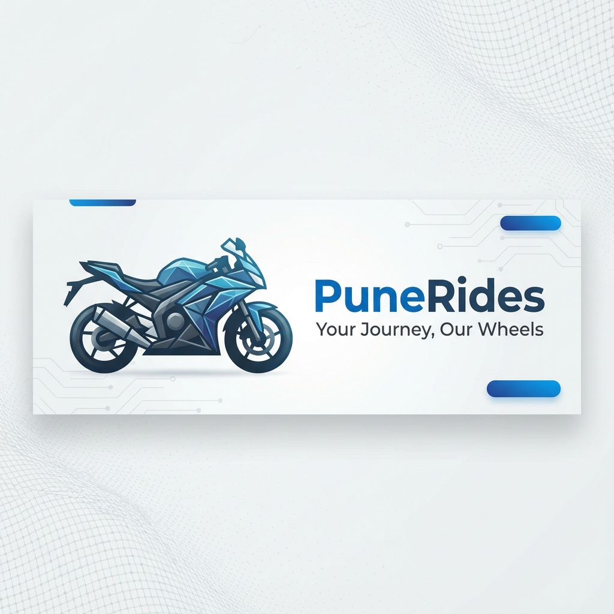

# PuneRides - Premium Bike Rental Service 🛵

PuneRides is a modern, responsive web application designed to simplify the bike rental experience in Pune. Whether you need a scooter for daily commutes or a cruiser for a weekend getaway, PuneRides offers a seamless platform to browse and book premium two-wheelers.

## 🌟 Features

*   **Modern & Responsive UI**: Built with React and Tailwind CSS, featuring a clean, "tech-mesh" aesthetic that looks great on all devices.
*   **Interactive Infographics**: A dedicated "Smart Mobility" section powered by **Recharts** and **Framer Motion**, visualizing the cost and environmental benefits of renting vs. owning.
*   **Dynamic Theme**: Fully supported **Dark Mode** that respects user preference and toggles seamlessly.
*   **Smooth Animations**: Engaging entry animations and micro-interactions for a polished user experience.
*   **Optimized Typography**: features a professional font stack (`sohne-var`, `Helvetica Neue`, `Arial`) for varying screen sizes.

## 🛠️ Tech Stack

*   **Frontend Framework**: [React](https://reactjs.org/) (via Vite)
*   **Styling**: [Tailwind CSS](https://tailwindcss.com/)
*   **Icons**: [Lucide React](https://lucide.dev/)
*   **Animations**: [Framer Motion](https://www.framer.com/motion/)
*   **Charts**: [Recharts](https://recharts.org/)
*   **Routing**: [React Router](https://reactrouter.com/)

## 🚀 Getting Started

Follow these steps to set up the project locally on your machine.

### Prerequisites

*   Node.js (v14 or higher)
*   npm or yarn

### Installation

1.  **Clone the repository**
    ```bash
    git clone https://github.com/yogesh123gn/PuneRides.git
    cd PuneRides
    ```

2.  **Install dependencies**
    ```bash
    npm install
    ```

3.  **Start the development server**
    ```bash
    npm run dev
    ```

4.  **Open in Browser**
    Navigate to `http://localhost:5173` to view the app.

## 📂 Project Structure

```
src/
├── components/      # Reusable UI components (Navbar, Hero, Infographics)
├── pages/           # Page layouts (Home, Requirements)
├── hooks/           # Custom hooks (useTheme)
├── assets/          # Static assets (images, icons)
├── data/            # Mock data (bike listings)
└── main.tsx         # Application entry point
```

## 🤝 Contributing

Contributions are welcome! If you have suggestions or want to improve the codebase, feel free to fork the repo and submit a Pull Request.

1.  Fork the Project
2.  Create your Feature Branch (`git checkout -b feature/AmazingFeature`)
3.  Commit your Changes (`git commit -m 'Add some AmazingFeature'`)
4.  Push to the Branch (`git push origin feature/AmazingFeature`)
5.  Open a Pull Request

## 📄 License

This project is licensed under the MIT License.

---
*Built with ❤️ for the riders of Pune.*
