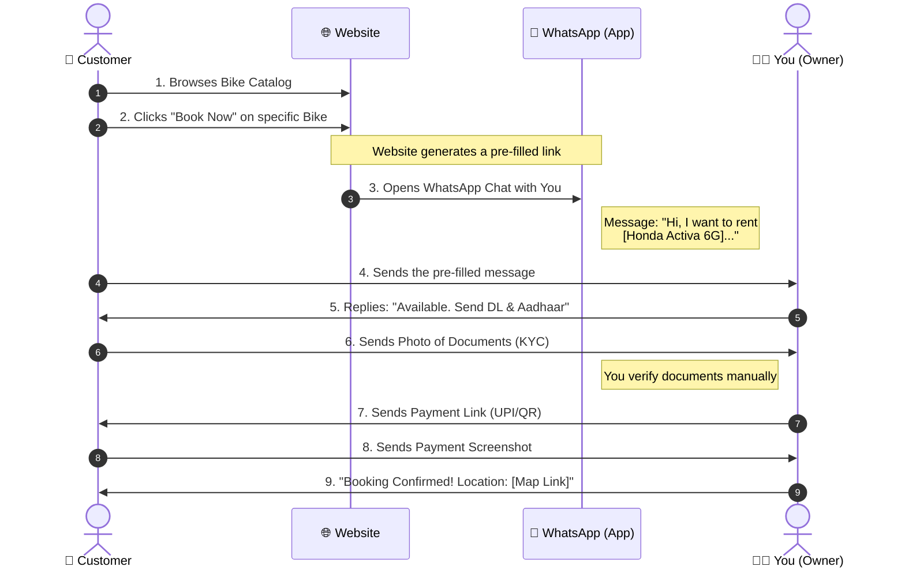

# App Workflow: Website to WhatsApp Booking

This document illustrates the seamless flow between your Bike Rental Website and WhatsApp. This "No-Backend" approach relies on WhatsApp for the actual transaction logic, reducing development time and cost while increasing personal trust.

## The Workflow Diagram

## Detailed Stage Breakdown

### Stage 1: The "Hook" (Website)
*   **User Action**: The customer lands on your site, sees the "Honda Activa" for ₹400/day.
*   **System Action**: When they click "Book Now", the button doesn't open a form. It executes a smart link:
    *   `https://wa.me/919876543210?text=I%20am%20interested%20in%20Honda%20Activa`
*   **Why this works**: Users hate filling out long forms. Clicking a button to chat feels manageable and instant.

### Stage 2: The "Handshake" (WhatsApp)
*   **User Action**: The customer sees the message typed out for them in WhatsApp. They just hit **Send**.
*   **Your Action**: You receive a qualified lead. You know *exactly* what they want (Honda Activa) without asking.
*   **Interaction**: You can now ask custom questions: "For how many days?" or "Do you have a Pune local address?"

### Stage 3: The "Deal" (KYC & Payment)
*   **Trust Building**: Since you are chatting personally, the user feels comfortable sending photos of their ID.
*   **Verification**: You verify the driving license instantly. If it looks fake, you block them. No automated system can beat your intuition yet.
*   **Closing**: You send your UPI QR code. Money hits your bank account instantly. No platform fees (like 2-3% for payment gateways).

### Stage 4: Pickup
*   User arrives at your location (provided in chat).
*   You take the physical deposit.
*   Hand over keys.
